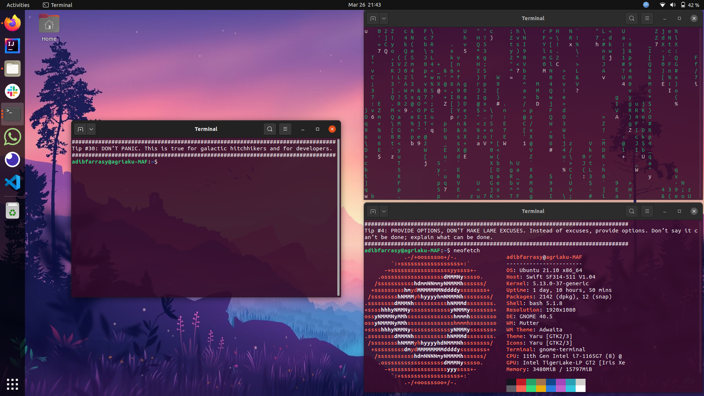

# Pragmatic Programmer Terminal Tips

## Setup

1. Copy the `tips.txt` file to your home directory (or any directory that you prefer, but the target file must be changed in the subsequent steps).

```shell
    cp tips.txt ~/tips.txt
```

2. Using your preferred text editor, add the following lines to your `~./bashrc` file.

```shell
    random=$(($RANDOM%100))
    col_num=$(tput cols)
    printf %${col_num}s |tr " " "#"
    echo ""
    head -$random ${HOME}/tips.txt | tail +$random
    printf %${col_num}s |tr " " "#"
```

3. Save the `~/.bashrc` file and reload the settings.

```shell
    source ~/.bashrc
```

After the setup is successful, you will see one random tip displayed on top of the terminal when you first open it.



_NOTE: I am not associated with the Pragmatic Programming authors and publishers._
